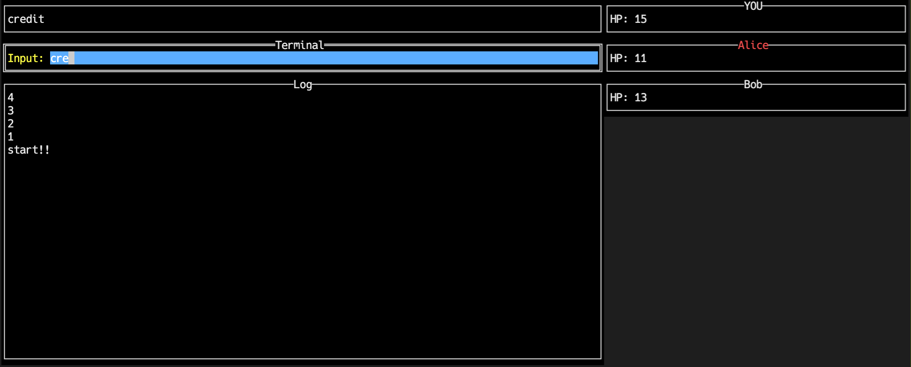

# Typex

対戦型バトルロイヤル形式のタイピングゲームです．

# Quick Start

## Build

```
make build
```

## Server

```
typex-server -player="ゲームのプレイヤー数" -port="ポート番号"
```

## Client

```
typex-client -name="ユーザ名" -addr="サーバの IP アドレス" -port="ポート番号"
```

## Demo



## Rules
- 表示されている単語の入力に成功するとターゲットの敵プレイヤーに1ダメージを与えます
- 現在のターゲットはプレイヤー名が赤く表示されます。
- ターゲットは変更することができます
    - "!n"でターゲットを上から順にn番目の敵プレイヤーに指定します(nは整数)
    - "!random"でターゲットをランダムに指定します
- 体力が1以上のプレイヤーが1人となったときゲームが終了し、そのプレイヤーがが勝者となります